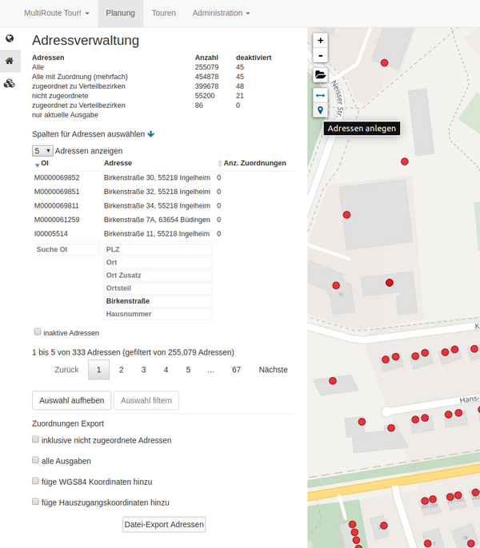

# **3. Adressverwaltung**

Bei der Verwaltung vieler Adressen ist es häufig sinnvoll, nach einzelnen Adressen suchen zu können. Sei es, um Abonnenten/Nicht-Abonnenten zu verwalten, Werbeverweiger einzutragen oder die optimale Abladestelle zu finden. Das Symbol für die Adressverwaltung ist das kleine :fontawesome-solid-house: auf der linken Seite.

Auch ist es hier möglich, eine nicht korrekte Gebäudekoordinate zu "<a href="https://tour.multiroute.de/handbuch/tipps/#adressen-umsetzen" target="_blank">verschieben</a>"  und an die richtige Stelle zu setzen.

## Adresssuche OSM

Grundsätzlich gibt es zwei Möglichkeiten nach Adressen zu suchen. Zum Einen gibt es das Suchfenster oben rechts in der Karte:


Hier erfolgt die Suche über den kompletten Straßenbestand von OpenStreetMap (OSM), den wir wöchentlich für Sie aktualisiert einspielen. Es können hier auch Adressen außerhalb Ihres Verbreitsgebiets gesucht und gefunden werden. Bei der Eingabe können Sie entweder die postalische Adresse (wie bei Google Maps bekannt) eingeben oder Koordinaten (mit Punkt und kommasepariert, bspw: 48.26014796334538, 11.558914102107815) eingeben.  


## Adresssuche im Verbreitungsgebiet

Die zweite Suchmöglichkeit ist das Suchen innerhalb Ihres Verbreitungsgebiets Dazu nutzen Sie die Adressverwaltung :fontawesome-solid-house:. 
MultiRoute Go! filtert dann sofort aus den bekannten Adressen und hilft so bei der Suche mit:


Wenn Sie über die OI suchen, dann geht das nur in der Adressverwaltung und nicht über die OSM Suche. Springen Sie direkt zur direkt richtig gefundenen Adresse, um bspw. Bemerkungen zu hinterlegen. **Start**-/**End**- oder **Zustellhäuser** zu setzen oder neue Gebäude anzulegen.

Durch den wiederholten Klick auf das :fontawesome-solid-house: klappt sich die linke Menüleiste ein und auch wieder aus.

## Neue Gebäude anlegen

Hin und wieder gibt es Neubaugebiete, in denen MultiRoute Go! noch keine Gebäude kennt. Diese können manuell per [Klick in die Karte](../tipps/#adressen-neu-anlegen) hinzugefügt werden. Bitte denken Sie an die Eingabe der Hausnummer (und eventueller Zusätze)!



## Anzeige Adressen

Lassen Sie sich auch einfach mehr als die voreingestellten 5 Adressen anzeigen:


Hier finden Sie auch die Möglichkeit, sich **inaktive Adressen** anzeigen zu lassen.
Adressen, die auf inaktiv gesetzt wurden, werden in <span style="color: blue;">&#x1f534;&#xfe0e;</span> angezeigt. Sie werden bei der Gehfolgenberechnung nicht berücksichtigt. **Der Status "inaktiv" wird in allen Ausgaben übernommen**. Ein inaktives Haus wird nie angegangen.


## Farben der Adresspunkte

Die [Bedeutung der Einfärbungen](../gebietsplanung/#bedeutung-der-punkteinfarbungen) hilft bei der Arbeit mit den einzelnen Gebäudepunkten.

## Attribute von Adressen verändern

Hinter jeder Adresse können Attribute liegen, die für die späteren Berechnungen von Bedeutung sind. Üblicherweise liefern wir Ihnen die Angaben zu Anzahl der Haushalte und Anzahl der Gewerbebetriebe bereits mit. Weitere Informationen zu Abonnenten oder Werbeverweigerern können sowohl manuell als auch über eine Schnittstelle angespielt werden.
Einfach auf das entsprechende Gebäude klicken und dort auf :material-note-edit:{style="color:#0078A8"}. Im nachfolgenden Fenster können Sie Änderungen durchführen und anschließend mit ```Speichern``` bestätigen.


Möchten Sie für viele Gebäude auf einmal die Attribute ändern, so geht das auch. Einfach ein Polygon "malen" und es öffnet sich eine Liste der darin befindlichen Gebäude. Darin können bündelweise Eigenschaften verändert werden (z.B. eine Straßen-ID).


## Weitere Tipps & Tricks zur manuellen Nachbearbeitung
Beachten Sie auch die [Hinweise von MultiRoute Tour!](https://tour.multiroute.de/handbuch/tipps/), wo mehr Adressen manuell nachbearbeitet werden.
