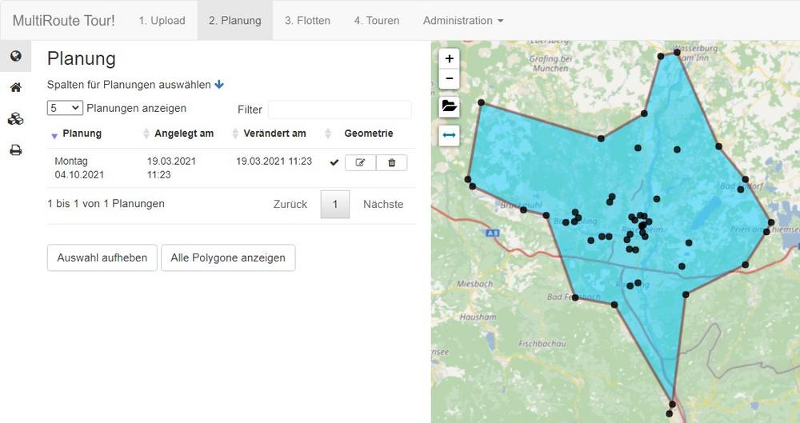
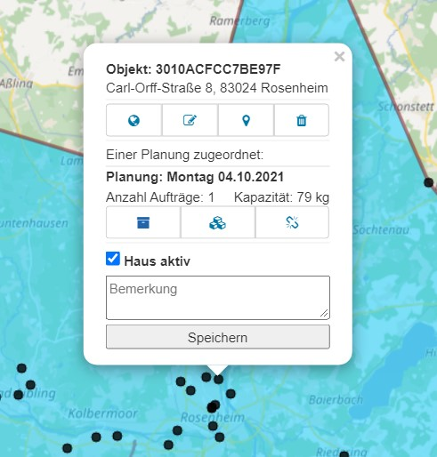
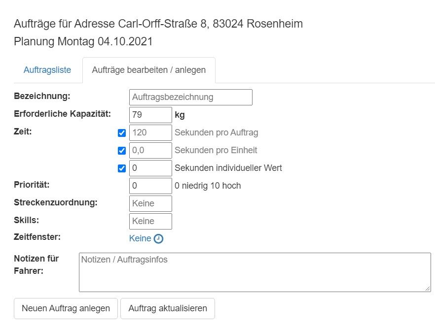

# **2. Die Gebietsplanung**

## Bedienung
In der Planung können Sie sich Ihre Aufträge anzeigen lassen und diese bearbeiten.

{ loading=lazy }

Jeder schwarze Punkt ist eine Adresse. An den Adressen können Sie sich ansehen, in welcher Planung, d.h. an welchen Tagen (oder Wochen) Aufträge vorhanden sind. 

{ loading=lazy }

Diese Aufträge können Sie mit einem Klick auf die drei Kistchen bearbeiten und nach Bedarf anpassen, sollte bspw. ein Kunde ausfallen oder sich ein Zeitfenster ändern. 

{ loading=lazy }

## Adressverwaltung

Die Adressverwaltung befindet sich unter Planung in der linken Sidebar mit einem Klick auf das Haus-Symbol.

Hier können Ihre Adressen durchsucht werden. Gelöscht werden können diese nur durch den Administrator unter Administration -> Upload

Neue Adressen können durch den [Upload](/upload) oder [manuell per Klick in die Karte](/tipps/#adressen-neu-anlegen) hinzugefügt werden.

