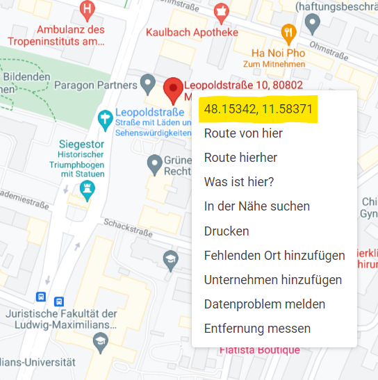
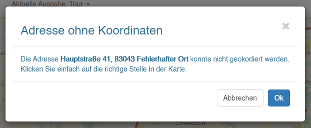
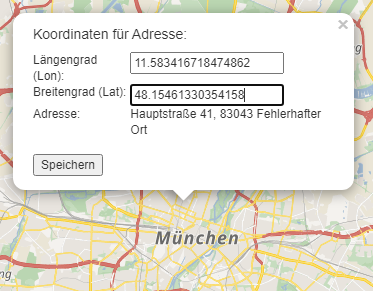
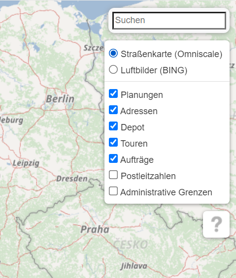

# Tipps & Tricks 

Tipps & Tricks bei der Arbeit mit MultiRoute Go! tauchen in den Texten auch zwischendurch auf und sind mit einem :exclamation: gekennzeichnet.

## Spalten anpassen ##
Durch Klick auf den blauen Pfeil :material-arrow-down:{style="color:blue"} haben Sie die Möglichkeit, **Spalten selbst zu definieren**, die Sie angezeigt bekommen möchten. Ein erneuter Klick auf :material-arrow-up:{style="color:blue"} schließt dieses Menü wieder.

## Adressen korrigieren über die Karte

Falls Sie neue Gebäude anlegen oder korrigieren müssen, geht das ganz einfach:

- Am besten ist es, wenn Sie die entsprechenden Adressen überprüfen. Eine einfache Google-Suche offenbart bereits schon, wo der Fehler lag. In diesem Falle korrigieren Sie die Adresse am besten gleich in Ihrer Ursprungssoftware, sodass in Zukunft die richtige Adresse exportiert wird. 

- Können Sie keinen Fehler feststellen oder möchten Sie die Adresse nicht abändern, können Sie diese auch einfach in MultiRoute Go! einmalig korrigieren. Bei weiteren Uploads wird dann immer die von Ihnen gesetzte Koordinate für die entsprechende Adresse verwendet. 

Hierzu gehen Sie wie folgt vor:

1) Suchen Sie die Adresse auf Google Maps und klicken Sie mit der rechten Maustaste auf das Gebäude bzw. die Adresse, für die Sie die Koordinate in MultiRoute Go! übernehmen möchten. Kopieren Sie die Koordinate mit einem Klick in Ihren Zwischenspeicher.

Kartendaten © 2021 COWI,GeoBasis-DE/BKG (©2009),Google

2) Klicken Sie in MultiRoute Go! auf die Adresse, die Sie korrigieren möchten. Es öffnet sich ein Korrekturfenster. Bestätigen Sie.

3) Klicken Sie mit dem Fadenkreuz in die Karte. Hier können Sie nun entweder manuell die Adresse in der Karte suchen oder Sie kopieren die Koordinaten in das Eingabefenster. Zuerst die kleinere (Longitude), dann die größere Zahl (Latitude).

4) Speichern Sie. Die Adresse ist nun auch für weitere Uploads an der richtigen Koordinate gespeichert. 

## Ausreißer identifizieren
Exportieren Sie die berechneten Gehfolgen. Mit Hilfe einer Pivot-Tabelle können Sie exakt ermitteln, welche Adressen die teuersten in jedem Bezirk sind und sich diese näher anschauen. Hier zwei Videos, die Ihnen helfen:

[Wie bekomme ich die Gehfolgen zu Excel?](https://youtu.be/Ncu99z_hUEQ)

[Wie ermittele ich "teure Adressen" mithilfe der Pivot-Funktion?](https://youtu.be/1mqFSzEmlVw)

## Kartenebenen an- und ausschalten 

In der Karte finden Sie oben rechts die sogenannte Layersteuerung. Hier können Sie mit der Maus einzelne Kartenebenen an- und ausschalten. 

Wenn Sie auf das Fragezeichen und anschließend in die Karte klicken, können Sie sich zusätzlich die Postleitzahl und Ort für einen beliebigen Punkt anzeigen lassen. 

## Sicherheitskopie gezeichneter Bezirke

MultiRoute Go! kann jederzeit für Sie automatisiert die Polygone der Trägerbezirke neu erzeugen. Haben Sie sich aber die Mühe gemacht und alle Trägerbezirke besonders "hübsch" gezeichnet, dann empfehlen wir, diese von Zeit zu Zeit zu sichern!
Einfach in der entsprechenden Ausgabe auf Administration - Verteilbezirke gehen. 
Hier als kml oder kmz sichern:

