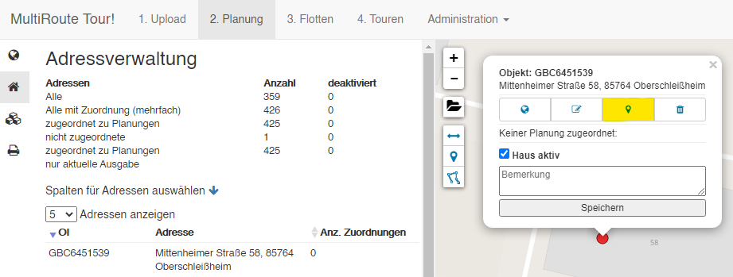
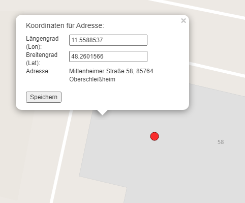
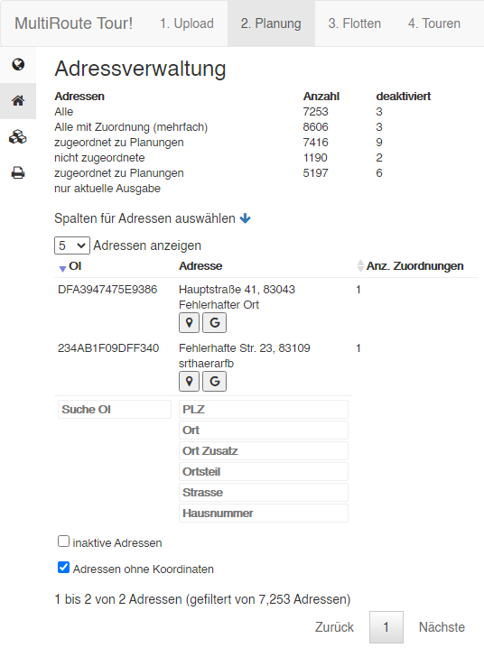
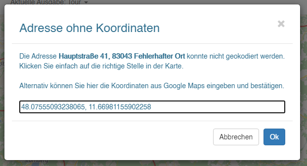

# Tipps & Tricks 

Tipps & Tricks bei der Arbeit mit MultiRoute Go! tauchen in den Texten auch zwischendurch auf und sind mit einem :exclamation: gekennzeichnet.

## Spalten anpassen ##
Durch Klick auf den blauen Pfeil :material-arrow-down:{style="color:blue"} haben Sie die Möglichkeit, **Spalten selbst zu definieren**, die Sie angezeigt bekommen möchten. Ein erneuter Klick auf :material-arrow-up:{style="color:blue"} schließt dieses Menü wieder.

## Adressen umsetzen 

Wenn Sie feststellen, dass eine Adresse nicht optimal gesetzt wurde, können Sie diese jederzeit umsetzen. 

Dies ist z.B. bei großen Fabrikgeländen oder Hintereingängen nützlich, sodass die Fahrer direkt zum richtigen Eingang navigiert werden. 

1) Klicken Sie unter **2. Planung** auf den gewünschten Punkt auf der Karte. Es öffnet sich ein kleines Popup. Klicken Sie auf die Pinnadel (gelb markiert).

2) Setzen Sie die die Adresse nun mit dem Fadenkreuz auf die richtige Stelle. Falls Sie exakte Koordinaten eingeben möchten, können Sie dies hier tun, ansonsten speichern Sie lediglich.

Fertig. Die Adresse ist umgesetzt. Bei weiteren Uploads bleibt diese Adresse auch für die Zukunft umgesetzt, wenn Sie sie nicht löschen. 

 

## Adressen korrigieren mit Google Maps

Wenn es beim Hochladen Ihrer Datei Adressen gab, für die keine Koordinate gefunden werden konnte, können Sie diese ganz einfach mithilfe einer Suche über Google Maps korrigieren. 

1) Zeigen Sie sich unter **2.Planung -> Adressverwaltung (kleines Ordnersymbol)** und einem Klick auf die Checkbox **"Adressen ohne Koordinaten"**alle Adressen an, die nicht korrigiert werden konnten.

2) Hier sehen Sie zwei kleine Buttons. Die Pinnadel sucht die Adresse direkt in der Karte. Kann diese hier nicht gefunden werden, suchen Sie Ihre Adresse mit einem Klick auf das Google-Logo. Dieser öffnet einen neuen Tab in Ihrem Browser und sucht Ihre Adresse. 

3) In Google Maps klicken Sie mit der rechten Maustaste auf den Punkt, wo Ihre Adresse liegt und kopieren sich mit einem Rechtsklick die Koordinate in den Zwischenspeicher.

4) In MRT! klicken Sie in der Spalte "OI" auf die entsprechende Adresse. Ein kleines Fenster öffnet sich, wo Sie nun die Koordinate mit STRG+V einfügen. Klicken Sie auf OK. Fertig! Die Koordinate ist nun für die Adresse übernommen worden. 

 

## Adressen korrigieren über die Karte

Wenn es beim Hochladen Ihrer Datei Adressen gab, für die keine Koordinate gefunden werden konnte, gibt es zwei Möglichkeiten diese zu korrigieren. 

- Am besten ist es, wenn Sie die entsprechenden Adressen überprüfen. Eine einfache Google-Suche offenbart bereits schon, wo der Fehler lag. In diesem Falle korrigieren Sie die Adresse am besten gleich in Ihrer Ursprungssoftware, sodass in Zukunft die richtige Adresse exportiert wird. 

- Können Sie keinen Fehler feststellen oder möchten Sie die Adresse nicht abändern, können Sie diese auch einfach in MultiRoute Go! einmalig korrigieren. Bei weiteren Uploads wird dann immer die von Ihnen gesetzte Koordinate für die entsprechende Adresse verwendet. 

Hierzu gehen Sie wie folgt vor:

1) Suchen Sie die Adresse auf Google Maps und klicken Sie mit der rechten Maustaste auf das Gebäude bzw. die Adresse, für die Sie die Koordinate in MultiRoute Go! übernehmen möchten. Kopieren Sie die Koordinate mit einem Klick in Ihren Zwischenspeicher.

Kartendaten © 2021 COWI,GeoBasis-DE/BKG (©2009),Google

2) Klicken Sie in MultiRoute Go! auf die Adresse, die Sie korrigieren möchten. Es öffnet sich ein Korrekturfenster. Bestätigen Sie.

4) Klicken Sie mit dem Fadenkreuz in die Karte. Hier können Sie nun entweder manuell die Adresse in der Karte suchen oder Sie kopieren die Koordinaten in das Eingabefenster. Zuerst die kleinere (Longitude), dann die größere Zahl (Latitude).

5) Speichern Sie. Die Adresse ist nun auch für weitere Uploads an der richtigen Koordinate gespeichert. 

 

## Ausreißer identifizieren

Die Ausreißer-Suche ist eine Erweiterung für die Routenberechnungs-Engine von MultiRoute Go!. Ausreißer eines Verteilbezirkes lassen sich identifizieren, wenn ihre Durchschnittsdistanz zu anderen Gebäuden desselben Verteilbezirkes markant hoch sind. Da hier aber die reine Durchschnittsdistanz zu den Gebäuden nicht als souveränes Maß verwendet werden kann (aufgrund der variablen Größe der Verteilbezirke), muss diese Angabe durch die Gesamtdurchschnittsdistanz aller Strecken der Distanzmatrix normiert werden. Auf diese Weise erhalten wir einen repräsentativen Wert um den Wert 1.0 für jedes Gebäude, der als "Durchschnitt-Zentralitätsmaß" interpretiert werden kann. Ausreißer erzielen dabei Werte größer 1.0. Gebäude, die sich eher im Zentrum befinden, besitzen dann einen Zentralitätswert kleiner 1.0. Mit Hilfe der Ausreißer-Suche können dann Gebäude identifiziert werden, bei denen die Zustellung besonders teuer ist. 
Lösungsvorschläge: andere Zuordnung oder auf inaktiv setzen und aus der Zustellung nehmen.

## Kartenebenen an- und ausschalten 

In der Karte finden Sie oben rechts die sogenannte Layersteuerung. Hier können Sie mit der Maus einzelne Kartenebenen an- und ausschalten. 

Wenn Sie auf das Fragezeichen und anschließend in die Karte klicken, können Sie sich zusätzlich die Postleitzahl und Ort für einen beliebigen Punkt anzeigen lassen. 

