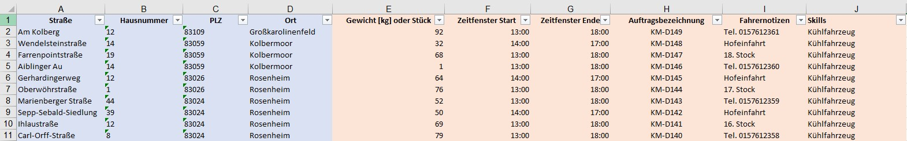

# **1. Datenintegration**

Haben Sie Ihre Bezirkseinheiten noch nicht digital vorhanden? Dann lesen Sie weiter unter "Bezirke manuell anlegen".
- 💾 [Musterliste](assets/downloads/Muster-Upload.xlsx)
- 💾 [Musterliste mit allen optionalen Spalten](assets/downloads/Muster-Upload-erweitert.xlsx)

Gibt es die Bezirkseinheiten schon digital, bieten wir aktuell folgende Möglichkeiten an:

## Übernahme aus einem anderen GIS

Egal bei welchem GIS-Anbieter Sie vorher schon Ihre Bezirksstrukturen abgebildet hatten, wir übernehmen Sie gerne direkt in MultiRoute Go!. Senden Sie uns einfach Musterdateien zu: service@zustellplaner.biz

## Zusätzliche optionale Spalten

Die notwendigen Spalten sind blau markiert, die optionalen orange. 

Neben einem Gewicht oder eine Stückzahl, können Sie ein oder mehrere Auftragszeitfenster festlegen. Diese können die Öffnungszeit(en) Ihres Kunden widerspiegeln. Sie können ebenfalls eine Auftragsbezeichnung und Notizen vergeben, die auf den Export-Dokumenten nach der Tourenberechnung wieder auftauchen. 

Mithilfe der Skills können Sie Besonderheiten abbilden, wenn ein Auftrag bspw. ein Kühlfahrzeug benötigt, sie aber eine heterogene Flotte von "normalen" Fahrzeugen und Kühlfahrezugen haben. Diese Skills werden ebenfalls in der Flotte eingegeben und den oder dem entsprechenden Fahrzeug(en) zugeordnet. 

💾 [Musterliste mit allen optionalen Spalten](assets/downloads/Muster-Upload-erweitert.xlsx)

## Upload in MultiRoute Tour!

In MultiRoute Tour! klicken Sie auf **1. Upload** und wählen Ihre Datei aus. Anschließend müssen Sie die Spalten Ihrer Datei auswählen, die von MultiRoute Tour! berücksichtigt werden sollen. 
Der Dateiname wird standardmäßig als Planungsbezeichnung genommen. Diese können Sie im Feld "An Planung" manuell nach Belieben anpassen, bspw. zu "Montag 04.10.2021".

